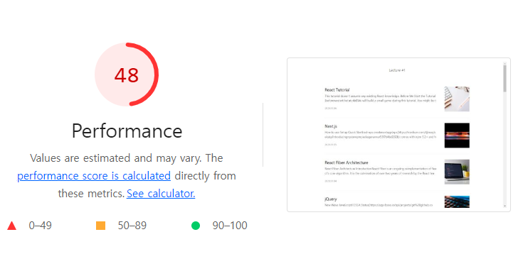
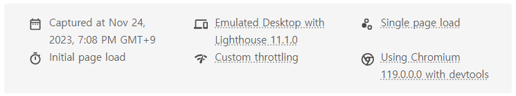
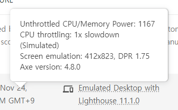
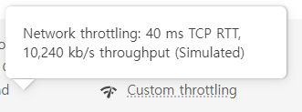
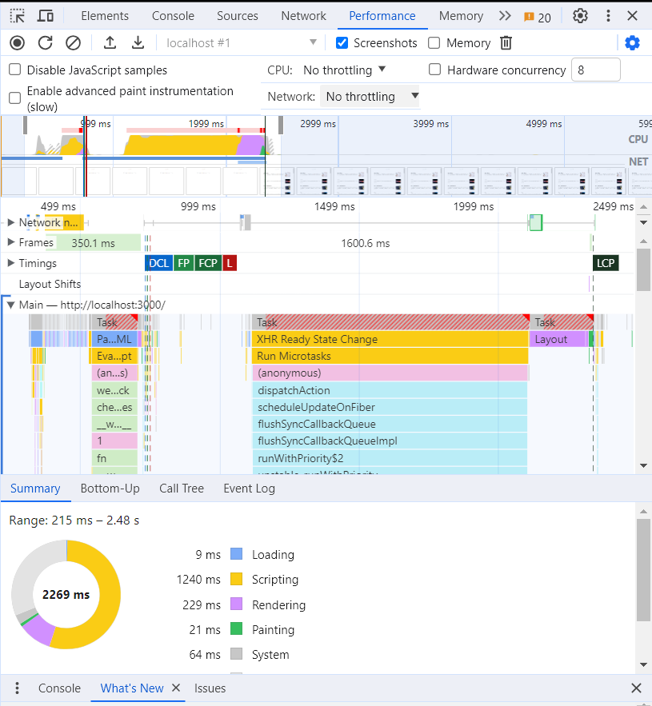

# 1주차

## Lighthouse

**Mode와 Categories 항목 값**

Mode

- Navigation: Lighthouse의 기본 값, 초기 페이지 로딩 시 발생하는 성능 문제 분석
- Timespan: 사용자가 정의한 시간 동안 발생한 성능 문제 분석
- Snapshot : 현재 상태의 성능 문제를 분석

Categories

- Performance : 웹 페이지의 로딩 과정에서 발생하는 성능 문제 분석
- Accessibility : 서비스의 사용자 접근성 문제 분석
- Best practices : 웹사이트의 보안 측면과 웹 개발의 최신 표준에 중점을 두고 분석
- SEO : 검색 엔진 크롤링과 검색 결과 표시 분석
- Progressive Web App : 서비스 워커와 오프라인 동작 등, PWA와 관련된 문제 분석

---

숫자는 이 웹 페이지의 종합 성능 점수
→ METRICS 부분에 가중치를 적용해 평균 낸 점수

> 이러한 지표를 웹 바이탈(Web Vitals) 이라고 부름

**METRICS**

- First Contentful Paint(FCP) : 페이지가 로드될 때 브라우저가 DOM 컨텐츠의 첫 번째 부분을 렌더링 하는 데 걸리는 시간에 관한 지표
- Speed Index(SI) : 페이지 로드 중에 콘텐츠가 시각적으로 표시되는 속도를 나타내는 지표
- Largest Contentful Paint(LCP) : 페이지가 로드될 때 화면 내에 있는 가장 큰 이미지나 텍스트 요소가 렌더링되기 까지 걸리는 시간을 나타내는 지표
- Time to Interactive(TTI) : 사용자가 페이지와 상호 작용이 가능한 시점까지 걸리는 시간을 측정한 지표
- Total Blocking Time(TBT) : 페이지가 클릭, 키보드 입력 등의 사용자 입력에 응답하지 않도록 차단된 시간을 총합한 지표
- Cumulative Layout Shift(CLS) : 페이지 로드 과정에서 발생하는 예기치 못한 레이아웃 이동을 측정한 지표

> OPPORTUNITIES와 DIAGNOSTICS 섹션으로 웹 페이지의 문제점과 해결 방안, 문제 해결로 얻을 수 있는 이점을 알 수 있음

---

→ 검사 환경 확인 가능

- 컴퓨터의 CPU 성능을 어느 정도 제한하여 검사를 진행하였는지 (1x : CPU 성능 제한 X)

- 네트워크 속도를 제한하여 어느 정도 고정된 네트워크 환경에서 성능을 측정하였는지 (10.240kbps 속도로 제한)

---

### 이미지 사이즈 최적화

OPPORTUNITIES - Properly size images

- 이미지를 적절한 사이즈로 사용하도록 제안

  - 실제 이미지 사이즈는 1200 \* 1200px 이지만, 화면에서는 120 \* 120px로 그려짐
  - 120 \* 120px로 만들 수도 있지만, 레티나 디스플레이 같은 경우 같은 픽셀에 더 많은 픽셀을 그릴 수 있기 때문에 **두 배** 정도 큰 이미지를 사용하는 것이 적절

- API를 통해 이미지를 받아오는 경우 → Cloudinary 나 Imgix 같은 이미지 CDN을 사용하여 이미지 사이즈 조절 가능
  - 이미지 CDN을 사용하면 이미지 사이즈를 줄이거나, 특정 포맷으로 변경하는 등의 작업이 가능함

### 병목 코드 최적화

DIAGNOSTICS - Reduce JavaScript execution time

- 메인 스레드의 작업을 상세히 살펴보고 느린 작업이 무엇인지 확인하기 위해 Performance 패널 활용
  

1. CPU 차트, Network 차트, 스크린샷

- CPU 차트 : 시간에 따라 CPU가 어떤 작업에 리소스를 사용하고 있는지 비율로 보여줌
  - 빨간색 선이 있는 부분이 병목 발생 지점 → 특정 작업이 메인 스레드를 오랫동안 잡아 두고 있음
- Network 차트 : CPU 차트 밑에 막대 형식으로 표시, 대략적인 네트워크 상태 표시
- 스크린샷 : 스크린샷의 리스트는 서비스가 로드되는 과정을 보여줌

2. Network 타임라인

- 서비스 로드 과정에서의 네트워크 요청을 시간 순서에 따라 보여줌

3. Frames, Timings, Main

- Frames 섹션 : 화면의 변화가 있을 때마다 스크린샷을 찍어 보여줌
- Timings 섹션 : User Timing API를 통해 기록된 정보를 기록 (리액트의 User Timing API 코드는 리액트 17 버전 이후 지원 종료)
- Main 섹션 : 브라우저의 메인 스레드에서 실행되는 작업을 플레임 차트로 보여줌
  > 플레임 차트? 소프트웨어의 작업(스택)을 손쉽게 추적하기 위해 개발된 계층형 데이터 시각화 기법 
  > X축은 시간의 흐름, Y축은 스택의 깊이 → 막대가 아래쪽에 있을 수록 상위 작업, 위쪽으로 갈수록 하위 작업 
  > 기본적인 플레임 차트는 아래서 위로 그려지지만, 크롬 개발자 도구는 위에서 아래로 그려짐

4. 하단 탭

- Summary 탭 : 선택 영역에서 발생한 작업 시간의 총합과 각 작업이 차지하는 비중
- Bottom-Up 탭 : 가장 최하위에 있는 작업부터 상위 작업까지 역순으로 보여줌
- Call Tree 탭 : 가장 상위 작업부터 하위 작업 순으로 작업 내용을 트리뷰로 보여줌
- Event Log 탭 : 발생한 이벤트를 보여줌
