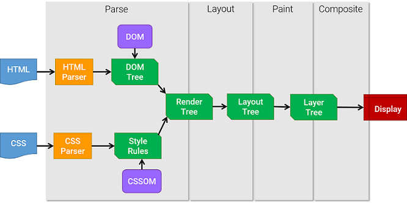

# 3주차

## 애니메이션 최적화

- 애니메이션 끊김 현상 → 쟁크(jank)

### 애니메이션 원리

> 여러 장의 이미지를 빠르게 전환하여 눈에 잔상을 남기고, 그로 인해 연속된 이미자가 움직이는 것처럼 느껴지게 하는 것

일반적으로 사용하는 디스플레이의 주사율은 60Hz → 1초에 60장의 정지된 화면을 빠르게 보여줌 <br/>
따라서 브라우저도 이에 맞춰 최대 60FPS로 1초에 60장의 화면을 새로 그림

애니메이션에서 쟁크 현상이 발생 하는 이유는 브라우저가 정상적으로 60FPS로 화면을 그리지 못하기 때문이라고 유추 가능

### 브라우저 렌더링 과정



**1. DOM + CSSOM** <br/>
HTML 파일과 CSS 등 화면을 그리는 데 필요한 리소스를 다운로드 <br/>
다운로드한 HTML은 브라우저가 이해할 수 있는 형태로 변환하는 파싱(parsing) 과정을 거침 <br/>
이후 요소 간의 관계가 트리(tree) 구조로 표현되어 있는 DOM을 생성 <br/>
CSS도 비슷한 과정을 거쳐 브라우저가 이해할 수 있는 형태로 변환하고 CSSOM이라는 트리 구조 생성 <br/>
CSSOM은 각 요소가 어떤 스타일을 포함하고 있는지에 대한 정보를 포함 <br/>

**2. 렌더 트리** <br/>
DOM과 CSSOM의 결합으로 생성 <br/>
렌더 트리는 화면에 표시되는 각 요소의 레이아웃을 계산하는 데 사용 (display: none으로 설정되어 있는 요소는 렌더 트리에 포함 X) <br/>
⚠️ opacity나 visivility: hidden 인 요쇼는 렌더 트리에 포함 됨 → 사용자의 눈에만 보이지 않는 것이고 요소 자체는 살아있음 <br/>

**3. 레이아웃** <br/>
레이아웃 단계에서는 화면 구성 요소의 위치나 크기를 계산하고, 해당 위치에 요소를 배치하는 작업 수행

**4. 페인트** <br/>
화면에 배치된 요소에 그려넣는 작업 수행 <br/>
ex. 배경 색 넣기, 글자 색 결정, 테두리 색 변경 등등 <br/>
브라우저는 효율적인 페인트 과정을 위해 구성 요소를 여러 개의 레이어(layer)로 나누어 작업하기도 함 <br/>

**5. 컴포지트** <br/>
각 레이어를 합성하는 작업 수행 <br/>
페인트 단계에서 여러 개의 레이어로 화면을 쪼개서 그린 후 레이어들을 하나로 합성하는 과정 <br/>

화면이 전부 그려진 후 스타일 변경이 생길 경우 주요 렌더링 경로에서 거친 과정을 다시 실행하면서 새로운 화면을 그리는데, 이를 리플로우(Reflow) / 리페인트(Repaint)라고 함

**6. 리플로우와 리페인트** <br/>

- 리플로우 <br/>

  - 처음 화면이 모두 그려진 후 스크립트를 통해 화면 내 요소가 변경되었다면 CSSOM을 새로 만들어야 함 <br/>
  - 이후 변경된 CSSOM를 이용하여 새로운 렌더 트리를 생성시킴 <br/>
    레이아웃 단계와 페인트 단계, 컴포지트 단계를 거치게 되는데 이것을 리플로우라고 부름 <br/>
  - 리플로우는 주요 렌더링 경로의 모든 단계를 모두 재실행하기 때문에 브라우저 리소스를 많이 사용하게 됨 <br/>

- 리페인트 <br/>
  - 레이아웃 관련 속성이 아닌 글자 색이나 배경 색 등, 색상 관련 속성이 변경될 시 CSSOM은 새로 생성되고 렌더 트리도 재생성 <br/>
  - 레이아웃이 변경된 것이 아니기 때문에 실행되지 않고 페인트 단계와 컴포지트 단계를 수행하는데 이를 리페인트라고 부름 <br/>
  - 리플로우 작업보단 빠르지만 리소스 부담은 존재 <br/>

> 리플로우와 리페인트를 피하기 위해선 transform, opacity와 같은 속성을 사용할 수 있음 <br/>
> 이런 속성을 사용하면 해당 요소를 별도의 레이어로 분리하고 작업을 GPU에 위임하여 처리하기 때문에 레이아웃 단계와 페인트 단계를 건너 뛸 수 있음 → 이를 하드웨어 가속 이라고 함

#### 하드웨어 가속(GPU 가속)

> 하드웨어 가속은 CPU에서 처리해야 할 작업을 GPU에 위임하여 더욱 효율적으로 처리하는 방법을 말함<br/>

- GPU는 애초에 그래픽 작업을 처리하기 위해 만들어진 것이므로 화면을 그릴 때 활용하면 굉장히 빠름

- 특정 요소에 하드웨어 가속을 사용하려면 요소를 별도의 레이어로 분리하여 GPU로 보내야 하는데, transform 속성과 opacity 속성이 이 역할을 함
  - 분리된 레이어는 GPU에 의해 처리되어 레이아웃 단계와 페인트 단계 없이 화면상의 요소 스타일을 변경 가능

## 컴포넌트 지연 로딩

### 지연 로딩의 장단점

- 장점 : 최초 페이지를 로드할 때 당장 필요 없는 모달과 관련된 코드가 번들에 포함되지 않아, 로드할 파일의 크기가 작아지고 초기 로딩 속도나 자바스크립트의 실행 타이밍이 빨라져서 화면에 더 빨리 표시됨
- 단점 : 초기 화면 로딩 시에는 효과적이나 모달을 띄우는 시점에서는 모달이 뜨기까지 약간의 지연이 발생할 수 있음<br/>
  → 이러한 문제는 사전 로딩(Preloading) 기법을 이용하여 해결

> 사전 로딩 : 나중에 필요한 모듈을 필요해지기 전에 미리 로드하는 기법

### 사전 로딩 타이밍

1. 사용자가 버튼 위에 마우스를 올려놓았을 때
2. 최초에 페이지가 로드되고 모든 컴포넌트의 마운트 종료 이후

### 이미지 사전 로딩

이미지 사이즈가 크면 다운로드 시간이 오래걸려서 다운로드가 완료될 때까지 아무것도 뜨지 않는 현상 발생 <br/>
→ 이미지를 미리 다운로드 하는 기법인 **이미지 사전 로딩 기법** 적용 가능

컴포넌트는 import 함수를 이용하여 로드하지만 이미지는 이미지가 화면에 그려지는 시점(HTML 또는 CSS에서이미지를 사용하는 시점)에 로드

자바스크립트로 이미지를 직접 로드하는 방법이 있음<br/>
Image 객체 사용

```js
// new 연산자를 이용해서 생성
const img = new Image();
img.src = "{이미지 주소}";
```

이 방법을 사용하면 코드가 입력된 순간 Network 패널에서 해당 이미지가 다운로드 됨

Image 객체를 사용했을 경우 테스트 시 `Disable cache` 옵션은 체크 해제 되어 있어야 함<br/>
→ 이미지 사전 로딩이 가능한 이유는 이미지를 로드할 때 브라우저가 해당 이미지를 캐싱해두기 때문<br/>
→ `Disable cache` 옵션이 체크되어 있으면 이미지 리소스에 대해 캐시하지 않아 매번 새로불러오게 됨<br/>
→ 다른 리소스도 캐시를 사용하기 때문에 정확한 분석에 지장

> 생각해볼 점<br/>
>
> - 몇 장의 이미지까지 사전 로드를 할 것인가?<br/>
>
> 모든 이미지를 사전 로딩하게 되면, 사전 로딩을 하는 순간 브라우저의 리소스를 그만큼 많이 사용하기 때문에 다른 성능 문제를 야기할 수 있음<br/> > **따라서 어떤 콘텐츠를 사전 로드할 때는 정말 사전 로딩이 필요한지 고민해보아야 함**
