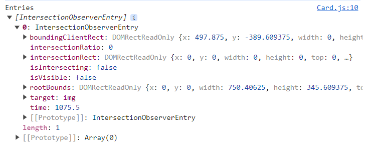
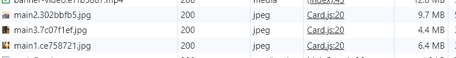
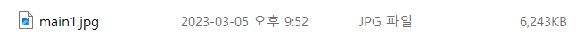
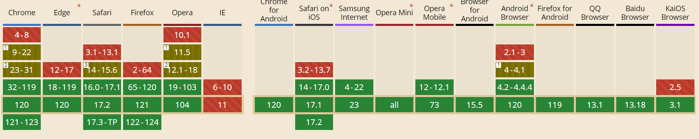

# 4주차

## 이미지 지연로딩

가장 처음 보여지는 콘텐츠가 가장 나중에 로드되면, 사용자가 첫 화면에서 아무것도 보지 못하기 때문에 사용자 경험에 좋지 않을 것<br/>
→ 이럴 때 당장 사용되지 않는 이미지를 나중에 다운로드하고 맨 처음 보여야하는 동영상을 먼저 다운로드함 (이미지 지연 로드)<br/>

이미지 로드는 언제 해야하나?<br/>

- 뷰포트에 이미지가 표시될 위치까지 스크롤 되었을 때로 판단 가능

### Intersection Observer

스크롤 이동에 따른 이미지 지연 로딩을 위해 스크롤 이벤트에 로직을 넣으면 스크롤을 할 때마다 해당 로직이 반복 실행<br/>
→ 조금이라도 무거운 로직이 들어가면 메인 스레드에 무리가 생길 것<br/>

이런 스크롤 문제를 **Intersection Observer** 로 해결 할 수 있음

> **Intersection Observer?** <br/>
> 브라우저에서 제공하는 API<br/>
> 이를 통해 웹 페이지의 특정 요소를 관찰하면 페이지 스크롤 시, 해당 요소가 화면에 들어왔는지 아닌지를 알려줌<br/>
> 스크롤 이벤트처럼 스크롤 할 때마다 함수를 호출하는 것이 아닌 요소가 화면에 들어왔을 때만 함수 호출<br/> > https://developer.mozilla.org/en-US/docs/Web/API/Intersection_Observer_API

```js
// Intersection Observer 예제 코드

// Intersection Observer의 옵션 설정
const options = {
  root: null, // 대상 객체의 가시성을 확인할 때 사용되는 뷰포트 요소(null로 설정 시 브라우저의 뷰포트로 설정)
  rootMargin: "0px", // root의 여백 (root의 가시범위를 가상으로 확장하거나 축소 가능)
  threshold: 1.0, // 가시성 퍼센티지, 대상 요소가 어느 정도로 보일 때 콜백을 실행할지 결정 (1.0 → 대상 요소가 모두 보일 때 / 0 → 1px이라도 보일 때)
};

// 가시성이 변경될 때마다 실행되는 함수
const callback = (entries, observer) => {
  console.log("Entries", entries);
};

// options와 callback 정의 후 IntersectionObserver 객체 생성하면 observer 인스턴스 생성 완료
const observer = new IntersectionObserver(callback, options);

// 이 인스턴스를 이용하여 원하는 요소 관촬
observer.observe(document.querySelector("#target-element1"));
observer.observe(document.querySelector("#target-element2"));

// 대상 요소의 가시성이 변할 때마다 콜백이 실행되며 콜백에서는 첫 번째 인자로 가시성이 변한 요소(entries)를 배열 형태로 전달 받음
// 이후 원하는 로직 실행
```



`console.log("Entries", entries);` 결과

- isIntersecting : 해당 요소가 뷰포트 내에 들어왔는지를 나타내는 값, 이 값을 통해 해당 요소가 화면에 보이는지 나갔는지 확인 가능

## 이미지 사이즈 최적화

이미지 지연로딩을 적용시킨 후 스크롤이 이미지 위치에 도달하는 순간 로드하기 때문에 이미지가 잘려 보일 수 있음



이미지 사이즈가 크면 다운로드에 많은 시간이 걸려 이미지 사이즈 최적화가 필요<br/>

> 이미지 사이즈 최적화 : 이미지의 사이즈를 줄여 이미지의 용량을 줄이고 그만큼 빠르게 다운로드하는 기법

### 이미지 포맷 종류

- **PNG**
  - 무손실 압축 방식으로 원본을 훼손 없이 압축하여 알파 채널을 지원
  - 알파 채널 → 투명도
  - PNG 포맷으로 배경 색을 투명하게 하여 뒤에 있는 요소가 보이는 이미지를 만들 수 있음
- **JPG**
  - 압축 과정에서 정보 손실 발생
  - 하지만 그만큼 이미지를 더 작은 사이즈로 줄일 수 있음
  - 일반적으로 웹에서 이미지를 사용할 때, 고화질이어야 하거나 투명도 정보가 필요하지 않으면 JPG 사용
- **WebP**
  - 무손실 압축과 손실 압축을 모두 제공하는 최신 이미지 포맷
  - 기존 PNG나 JPG에 비해 효율적으로 이미지 압축 가능
  - 최신 이미지 파일 포맷이기 때문에 브라우저 호환성을 고려 해야함

https://squoosh.app/ 에서 이미지 변환




### WebP의 호환성 문제



WebP 로만 이미지를 렌더링할 경우 특정 브라우저에서는 제대로 렌더링이 되지 않을 수 있음<br/>
→ 단순 `` 태그가 아닌 `<picture />` 태그를 사용<br/>

`<picture />` 태그는 다양한 타입의 이미지를 렌더링하는 컨테이너로 사용

```html
# 뷰포트로 구분
<picture>
  <source media="(min-width:650px)" srcset="img_pink_flowers.jpg" />
  <source media="(min-width:465px)" srcset="img_white_flower.jpg" />
  
</picture>

# 이미지 포맷으로 구분
<picture>
  <source srcset="photo.avif" type="image/avif" />
  <source srcset="photo.webp" type="image/webp" />
  
</picture>
```

## 동영상 최적화

https://www.media.io/ 를 통해 동영상 압축<br/>

이미지 최적화와 비슷하게 압축 방식을 변경하여 동영상의 용량을 축소<br/>

동영상 압축 후 화질이 저하되는 점을 유의 해야 함

- 저하된 화질 보완하는 법
  - 패턴과 필터를 이용하여 동영상 위에 씌우면 사용자는 동영상의 화질이 좋지 않음을 쉽게 인지할 수 없음
  - 가장 효과적인 것은 blur 사용 (video 요소에 css 코드로 `filter: bulr(10px)`)
  - 굳이 동영상을 있는 그대로 보여줄 필요가 없거나, 배경만으로 가볍게 사용할 때 효과적
