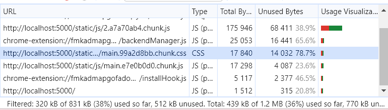

# 4주차

## 이미지 지연로딩

가장 처음 보여지는 콘텐츠가 가장 나중에 로드되면, 사용자가 첫 화면에서 아무것도 보지 못하기 때문에 사용자 경험에 좋지 않을 것<br/>
→ 이럴 때 당장 사용되지 않는 이미지를 나중에 다운로드하고 맨 처음 보여야하는 동영상을 먼저 다운로드함 (이미지 지연 로드)<br/>

이미지 로드는 언제 해야하나?<br/>

- 뷰포트에 이미지가 표시될 위치까지 스크롤 되었을 때로 판단 가능

### Intersection Observer

스크롤 이동에 따른 이미지 지연 로딩을 위해 스크롤 이벤트에 로직을 넣으면 스크롤을 할 때마다 해당 로직이 반복 실행<br/>
→ 조금이라도 무거운 로직이 들어가면 메인 스레드에 무리가 생길 것<br/>

이런 스크롤 문제를 **Intersection Observer** 로 해결 할 수 있음

> **Intersection Observer?** <br/>
> 브라우저에서 제공하는 API<br/>
> 이를 통해 웹 페이지의 특정 요소를 관찰하면 페이지 스크롤 시, 해당 요소가 화면에 들어왔는지 아닌지를 알려줌<br/>
> 스크롤 이벤트처럼 스크롤 할 때마다 함수를 호출하는 것이 아닌 요소가 화면에 들어왔을 때만 함수 호출<br/> > https://developer.mozilla.org/en-US/docs/Web/API/Intersection_Observer_API

```js
// Intersection Observer 예제 코드

// Intersection Observer의 옵션 설정
const options = {
  root: null, // 대상 객체의 가시성을 확인할 때 사용되는 뷰포트 요소(null로 설정 시 브라우저의 뷰포트로 설정)
  rootMargin: "0px", // root의 여백 (root의 가시범위를 가상으로 확장하거나 축소 가능)
  threshold: 1.0, // 가시성 퍼센티지, 대상 요소가 어느 정도로 보일 때 콜백을 실행할지 결정 (1.0 → 대상 요소가 모두 보일 때 / 0 → 1px이라도 보일 때)
};

// 가시성이 변경될 때마다 실행되는 함수
const callback = (entries, observer) => {
  console.log("Entries", entries);
};

// options와 callback 정의 후 IntersectionObserver 객체 생성하면 observer 인스턴스 생성 완료
const observer = new IntersectionObserver(callback, options);

// 이 인스턴스를 이용하여 원하는 요소 관촬
observer.observe(document.querySelector("#target-element1"));
observer.observe(document.querySelector("#target-element2"));

// 대상 요소의 가시성이 변할 때마다 콜백이 실행되며 콜백에서는 첫 번째 인자로 가시성이 변한 요소(entries)를 배열 형태로 전달 받음
// 이후 원하는 로직 실행
```


`console.log("Entries", entries);` 결과

- isIntersecting : 해당 요소가 뷰포트 내에 들어왔는지를 나타내는 값, 이 값을 통해 해당 요소가 화면에 보이는지 나갔는지 확인 가능

## 이미지 사이즈 최적화

이미지 지연로딩을 적용시킨 후 스크롤이 이미지 위치에 도달하는 순간 로드하기 때문에 이미지가 잘려 보일 수 있음


이미지 사이즈가 크면 다운로드에 많은 시간이 걸려 이미지 사이즈 최적화가 필요<br/>

> 이미지 사이즈 최적화 : 이미지의 사이즈를 줄여 이미지의 용량을 줄이고 그만큼 빠르게 다운로드하는 기법

### 이미지 포맷 종류

- **PNG**
  - 무손실 압축 방식으로 원본을 훼손 없이 압축하여 알파 채널을 지원
  - 알파 채널 → 투명도
  - PNG 포맷으로 배경 색을 투명하게 하여 뒤에 있는 요소가 보이는 이미지를 만들 수 있음
- **JPG**
  - 압축 과정에서 정보 손실 발생
  - 하지만 그만큼 이미지를 더 작은 사이즈로 줄일 수 있음
  - 일반적으로 웹에서 이미지를 사용할 때, 고화질이어야 하거나 투명도 정보가 필요하지 않으면 JPG 사용
- **WebP**
  - 무손실 압축과 손실 압축을 모두 제공하는 최신 이미지 포맷
  - 기존 PNG나 JPG에 비해 효율적으로 이미지 압축 가능
  - 최신 이미지 파일 포맷이기 때문에 브라우저 호환성을 고려 해야함

https://squoosh.app/ 에서 이미지 변환


### WebP의 호환성 문제


WebP 로만 이미지를 렌더링할 경우 특정 브라우저에서는 제대로 렌더링이 되지 않을 수 있음<br/>
→ 단순 `` 태그가 아닌 `<picture />` 태그를 사용<br/>

`<picture />` 태그는 다양한 타입의 이미지를 렌더링하는 컨테이너로 사용

```html
# 뷰포트로 구분
<picture>
  <source media="(min-width:650px)" srcset="img_pink_flowers.jpg" />
  <source media="(min-width:465px)" srcset="img_white_flower.jpg" />
  
</picture>

# 이미지 포맷으로 구분
<picture>
  <source srcset="photo.avif" type="image/avif" />
  <source srcset="photo.webp" type="image/webp" />
  
</picture>
```

## 동영상 최적화

https://www.media.io/ 를 통해 동영상 압축<br/>

이미지 최적화와 비슷하게 압축 방식을 변경하여 동영상의 용량을 축소<br/>

동영상 압축 후 화질이 저하되는 점을 유의 해야 함

- 저하된 화질 보완하는 법
  - 패턴과 필터를 이용하여 동영상 위에 씌우면 사용자는 동영상의 화질이 좋지 않음을 쉽게 인지할 수 없음
  - 가장 효과적인 것은 blur 사용 (video 요소에 css 코드로 `filter: bulr(10px)`)
  - 굳이 동영상을 있는 그대로 보여줄 필요가 없거나, 배경만으로 가볍게 사용할 때 효과적

# 5주차

## 폰트 최적화


사용자는 페이지가 로드되고 대략 8초 후에야 폰트가 제대로 된 페이지를 볼 수 있게 됨<br/>

> 폰트의 변화로 발생하는 깜박이는 현상이나 다른 요소를 밀어내는 현상을 FOUT(Flash of Unstyled Text) 또는 FOIT(Flash of Invisible Text) 라고 함

- FOUT

  - Edge 브라우저에서 폰트를 로드하는 방식
  - 폰트의 다운로드 여부와 상관없이 먼저 텍스트를 보여 준 후 폰트가 다운로드 되면 그때 폰트를 적용

- FOIT
  - 크롬, 사파리, 파이어폭스 등에서 폰트를 로드하는 방식
  - 폰트가 완전히 다운로드 되기 전까지 텍스트 자체를 보여주지 않음
  - 폰트 다운로드 완료 후 폰트가 적용된 텍스트를 보여줌

> 🤚 크롬에서 테스트를 해보면 폰트가 제대로 다운로드되지 않아도 텍스트가 보이는데? <br/>
> 완전한 FOIT 방식이 아닌 3초만 기다리는 FOIT 이기 때문<br/>
> → 3초 동안은 폰트가 다운로드되기를 기다리다가 3초가 지나도 폰트가 다운로드 되지 않으면 기본 폰트로 텍스트를 보여줌<br/>
> 이후 폰트 다운로드가 완료되면 해당 폰트 적용<br/> 

**폰트를 최대한 최적화하여 폰트 적용 시 발생되는 깜박임 현상을 최소화 해야 함**

### 폰트 최적화 방법

**1. 폰트 적용 시점 제어하기**

중요한 텍스트(뉴스 제목 등)의 경우 FOIT 방식으로 폰트를 적용하면 텍스트 내용이 사용자에게 빠르게 전달되지 않을 것<br/>
반면, 사용자에게 꼭 전달하지 않아도 되는 텍스트의 경우 FOUT 방식으로 인한 폰트 변화는 사용자의 시전을 분산 시킬 수 있음<br/>
→ 서비스 또는 콘텐츠의 특성에 맞는 적절한 방식을 적용해야 함

CSS의 `font-display` 속성을 사용하면 폰트가 적용되는 시점을 제어할 수 있음<br/>
`font-display` 속성은 `@font-face`에서 설정할 수 있음

- auto: 브라우저 기본 값
- block: FOIT (timeout = 3s)
- swap: FOUT
- fallback: FOIT (timeout = 0.1s) / 3초 후에도 불러오지 못한 경우 기본 폰트로 유지, 이후 캐시
- optional: FOIT (timeout = 0.1s) / 이후 네트워크 상태에 따라 기본 폰트로 유지할지 결정, 이후 캐시

fallback의 경우 3초 후에도 폰트를 다운로드하지 못한 경우, 이후에 폰트가 다운로드되더라도 폰트를 적용하지 않고 캐시<br/>
→ 최초 페이지 로드에서 폰트가 늦게 다운로드되면 폰트가 적용되지 않은 모습으로 계속 진행<br/>
→ 하지만 페이지를 다시 로드하면 폰트가 캐시되어 있어 바로 폰트가 적용된 텍스트를 볼 수 있음

optional의 경우 3초가 아닌 사용자의 네트워크 상태를 기준으로 폰트를 적용할지 기본 폰트로 유지할지 결정

```css
@font-face {
  font-family: BMYEONSUNG;
  src: url("./assets/fonts/BMYEONSUNG.ttf");
  font-display: fallback;
}
```

적용 예제에선 폰트가 적용된 상태로 보이는 것이 더 자연스러울 것이기데 block 옵션 사용<br/>
→ 폰트가 갑자기 나타나는 것은 어색할 수 있기 때문에 fade-in 애니메이션 적용<br/>
→ 폰트 다운로드가 완료되면 페이드 인 효과와 함께 폰트가 적용된 텍스트를 보여 줄 것<br/>
→ 폰트가 다운로드 완료되는 시점을 알아야 하는데 이는 **fontfaceobserver** 라이브러리를 사용하여 알 수 있음

**2. 폰트 파일 크기 줄이기**

**폰트 포맷 변경하기**

- 흔히 TTF, OTF 포맷을 사용하는데 이런 포맷은 파일 크기가 매우 큼
- 매번 리소스를 다운로드해야 하는 웹 환경에서는 적절하지 않음

→ 그래서 나온 것이 WOFF(Web Open Font Format)<br/>
→ TTF 폰트를 압축하여 웹에서 더욱 빠르게 로드할 수 있도록 만들어짐

하지만, WOFF와 WOFF2도 브라우저 호환성 문제가 있기 때문에 크로스 브라우징 작업 필요

폰트 포맷은 https://transfonter.org/ 에서 변환

- 서브셋 폰트 사용
  - 비디오 배너에서만 폰트를 사용 중이기 때문에 해당 문자의 폰트 정보만 가지고 있으면 됨
  - 모든 문자가 아닌 일부 문자의 폰트 정보만 가지고 있는 것을 서브셋(subset) 폰트라고 함
    

**Data-URI 형태로 CSS에 포함하기**

> Data-URI란 data 스킴이 접두어로 붙은 문자열 형태의 데이터<br/>
> → 파일을 문자열 형태로 변환하여 문서(HTML, CSS, JS 등)에 인라인으로 삽입하는 것

보통 App.css 파일이 로드된 후 폰트를 적용하기 위해 폰트 파일을 추가로 로드해야 되지만, Data-URI 형태로 만들어서 App.css 파일에 넣어두면 별도의 네트워크 로드 없이 App.css 파일에서 폰트 사용 가능

폰트 파일을 Data-URI 형태로 css에 포함하려면 폰트를 문자열 데이터로 변환해야함
(transfonter에서 Base64 encode 옵션을 on으로 변경)


기본적으로 브라우저에서 Data-URI를 네트워크 트래픽으로 인식하여 기록하지만 실제로는 이미 다른 파일 내부에 임베드되어 있어 별도의 다운로드 시간이 필요하지 않음

⚠️ Data-URI 형태가 항상 좋은 것은 아님

- 실제 폰트 내용은 App.css에 포함된 것이므로 App.css의 다운로드 속도 또한 고려해야함
- Data-URI가 포함된 만큼 App.css 파일의 다운로드는 느려질 수 있음(App.css는 main.chunk.js에 포함되어 빌드)
- 매우 큰 파일을 Data-URI 형태로 포함하면 포함한 파일 크기가 그만큼 커져서 또 다른 병목을 발생시킬 수 있음

## 캐시 최적화


네트워크를 통해 다운로드하는 리소스에 캐시를 적용하라는 의미<br/>
→ 네트워크 패널에서 리소스 중 하나를 확인해보면 응답 헤더에 캐시에 대한 설정인 `Cache-Control` 헤더가 없음을 알 수 있음 <br/>
→ 즉, npm run start로 실행한 서버에는 캐시 설정이 제대로 되어 있지 않은 것

> **캐시란?** <br/>
> 자주 사용하는 데이터나 값을 미리 복사해 둔 임시 저장 공간 또는 저장하는 동작을 말함

웹에서는 서비스에서 사용하는 이미지나 JS 파일을 매번 네트워크를 통해 불러오지 않고 최초에만 다운로드하여 캐시에 저장해두고 이후 요청 시 저장해 둔 파일을 사용

**캐시의 종류**

- 메모리 캐시 : 메모리에 저장하는 방식 (메모리 → RAM)
- 디스트 캐시 : 파일 형태로 디스크에 저장하는 방식

어떤 캐시를 사용할지는 직접 제어 불가 → 브라우저가 사용 빈도나 파일 크기에 따라 알아서 처리<br/>
(캐시 확인 시엔 Network 패널의 Disable cache 설정 off)

### Cache-Control

Cache-Control은 리소스의 응답 헤더에 설정되는 헤더<br/>
브라우저는 서버에서 이 헤더를 통해 캐시를 어떻게, 얼마나 적용해야 하는지 판단함

- no-cache : 캐시를 사용하기 전 서버에 검사 후 사용
- no-store : 캐시 사용 안함
- public : 모든 환경에서 캐시 사용 가능
- private : 브라우저 환경에서만 캐시 사용, 외부 캐시 서버에서는 사용 불가
- max-age : 캐시 유효 시간

no-cache는 사용 전에 서버에 캐시된 리소스를 사용해도 되는지 한번 체크하도록 하는 옵션이며, 캐시를 아예 사용하지 않는 다면 no-store를 사용

public과 private으로 설정하면 max-age에서 설정한 시간만큼은 서버에서 사용 가능 여부를 묻지 않고 캐시된 리소스를 바로 사용 (유효 시간이 지나면 서버에 체크 후 시간 만큼 더 사용)

캐시 환경에 따라 public과 private으로 구분

ex1. `Cache-Control: max-age=60` : 60초 동안 캐시 사용, private 옵션이 없으므로 public으로 설정되어 모든 환경에서 캐시<br/>
ex2. `Cache-Control: private, max-age=600` : 브라우저 환경에서만 600초 동안 캐시 사용<br/>
ex3. `Cache-Control: public, max-age=0` : 모든 환경에서 0초 동안 캐시 (매번 서버에 캐시 사용을 확인하기 때문에 no-cache와 동일한 설정)

유효 시간이 만료되면 status 코드가 변경되는데, 이는 기존에 캐시된 리소스를 그대로 사용해도 되는지, 리소스를 새로 다운로드해야 하는지 서버에 확인하기 때문<br/>
→ 예제에서는 서비스의 리소스가 변경되지 않아 그대로 사용 가능하기 때문에, 서버에서 변경되지 않았다는 304 상태 코드를 응답함

### 적절한 캐시 유효 시간

리소스마다 사용이나 변경 빈도가 다르기 때문에 캐시의 유효 시간도 달라야 함

일반적으로

- HTML 파일 : no-cache (항상 최신 버전의 웹 서비스를 제공하기 위함)
- JS, CSS 파일 : 빌드된 JS와 CSS는 파일명에 해시가 포함됨(main.bb8aac28.chunk.js) → 코드가 변경되면 해시도 변경되어 완전히 다른 파일이 됨 (HTML만 최신 상태면 항상 최신 리소스 로드)

## 불필요한 CSS 제거


개발자 도구의 Coverage 패널은 페이지에서 사용하는 JS 및 CSS 리소스에서 실제로 실행하는 코드가 얼마나 되는지 알려주며 그 비율을 표시해줌


Unused Btyes(사용하지 않는 바이트)와 Usage Visualization(사용량 시각화) 항목에서 전체 코드 대비 실행된 코드의 양을 비율로 표시


이 프로젝트는 Tailwind CSS를 사용하였기 때문에 라이브러리에서 추가한 스타일들이 있음<br/>
→ 미리 만들어진 클래스를 통해 쉽고 빠르게 스타일을 적용할 수 있지만, 빌드 후엔 사용하지 않는 스타일도 함께 빌드되어 파일 크기를 늘린다는 단점 존재<br/>
→ 사용하지 않는 스타일을 삭제하기 위해 PurgeCSS 툴 사용<br/>

https://purgecss.com/ 는 파일에 들어있는 모든 키워드를 추출하여 해당 키워드를 이름으로 갖는 CSS 클래스만 보존하고 매칭되지 않은 클래스는 모두 지우는 방식으로 CSS 파일을 최적화 해줌



- Coverage 패널은 파일의 코드가 실행되었는지 아닌지를 체크하는 것이기 때문에, 페이지에 따라 아직 표시되지 않은 요소들의 코드는 실행이 안된 것으로 인식됨 → 코드의 실행 비율은 사용자가 서비스를 이용하면서 증가됨
