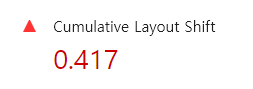
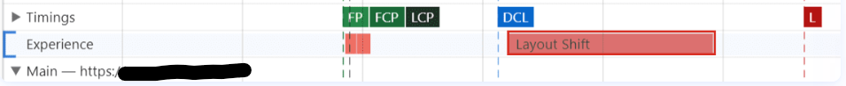
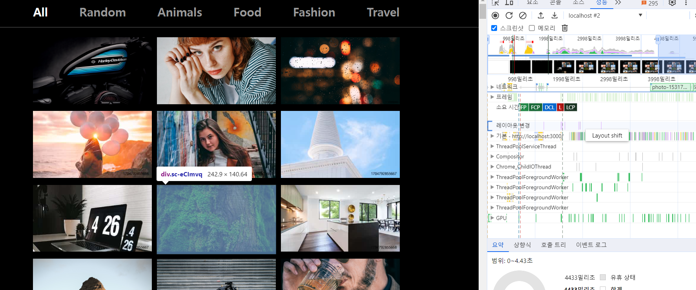

# 6주차

## 레이아웃 이동 피하기

> **레이아웃 이동 ?**<br/>
> 화면 상의 요소 변화로 레이아웃이 갑자기 밀리는 현상<br/>
> 레이아웃 이동은 사용자의 주의를 산만하게 만들고 위치를 순간적으로 변경시키면서 의도와 다른 클릭을 유발할 수 있음 <br/>
> → 좋지 않은 사용자 경험을 유발

Lighthouse 내에선 레이아웃 이동이 얼마나 발생하는지 **CLS(Cumulative Layoyr Shift)** 항목으로 성능 점수에 포함되어 있음



CLS는 0부터 1까지의 값을 가지며, 레이아웃 이동이 전혀 발생하지 않은 상태를 0, 그 반대를 1로 계산<br/>
👍 권장 점수는 0.1 이하

Performance 패널의 Experience 섹션에서 직접적인 원인 파악 가능



빨간 막대에 커서를 올려놓으면 서비스 화면에서 레이아웃 이동을 유발한 요소를 표시해줌



### 레이아웃 이동 원인

- 사이즈가 미리 정의되지 않은 이미지 요소
- 사이즈가 미리 정의되지 않은 광고 요소
- 동적으로 삽입된 콘텐츠
- 웹 폰트(FOIT, FOUT)

예제 코드에선 '사이즈가 미리 정의되지 않은 이미지 요소'로 인해 레이아웃 이동 발생

브라우저는 이미지를 다운로드하기 전까지 이미지 사이즈가 어떤지 알 수 없으니 미래 해당 영역을 확보할 수 없음

그렇기 때문에 이미지가 화면에 표시되기 전까지 해당 영역의 높이 또는 너비가 0 인 상태<br/>
→ 이후 이미지가 로드되면 해당 이미지의 사이즈로 변경되면서 그만큼 다른 요소들을 밀어내게 됨

※ 웹 폰트의 경우 폰트에 따라 글자의 크기가 조금씩 다른 차이 때문에 다른 요소의 위치에 영향을 줄 수 있음

### 레이아웃 이동 해결

> 레이아웃 이동을 일으키는 요소의 사이즈를 지정하기

해당 요소의 사이즈를 미리 예측 또는 알고 있다면 해당 사이즈만큼 공간을 확보해두게 됨

예제 코드의 이미지 사이즈는 브라우저의 가로 사이즈에 따라 변화<br/>
→ 단순히 너비와 높이를 고정하는 것이 아닌 이미지의 너비, 높이 비율로 공간을 잡으면 해결

**비율로 공간 잡는 방법**<br/>

1. padding을 이용하여 박스를 만든 뒤, 그 안에 이미지를 absolute로 띄우는 방식

```css
.wrapper {
  position: relative;
  width: 160px;
  padding-top: 56.25%; /* 16:9 비율 */
}

.image {
  position: absolute;
  width: 100%;
  height: 100%;
  top: 0;
  left: 0;
}
```

하지만 이 방법은 padding의 퍼센트를 매번 계산해야 하고 코드가 직관적이지 않다는 단점이 존재

2. aspect-ratio 속성 사용하는 방식

호환성 체크 후 적용

```css
.wrapper {
  width: 100%;
  aspect-ratio: 16 / 9;
}

.image {
  width: 100%;
  height: 100%;
}
```

## 이미지 지연 로딩

이미지 지연 로딩 기법으로 `react-lazyload` 라이브러리를 사용할 수도 있음

해당 라이브러리를 import하여 지연 로드하고자 하는 컴포넌트를 감싸주면 됨

LazyLoad의 자식으로 들어간 요소들은 화면에 표시되기 전까지 렌더링되지 않다가 스크롤을 통해 화면에 들어오는 순간 로드<br/>
→ 라이브러리를 사용하면 이미지 뿐만 아니라 일반 컴포넌트도 지연 로드 시킬 수 있음

지연 로드로 초기 화면의 리소스를 절약할 수 있는 것은 좋으나, 스크롤을 내려 화면에 이미지가 들어올 때 이미지를 로드하기 때문에 시간이 지나고 이미지가 뜨는 단점이 발생<br/>
→ `react-lazyload`의 offset 옵션으로 해결 가능

offset 옵션은 얼마나 미리 로드할지 픽셀 값으로 지정 가능<br/>
ex. offset을 100으로 지정하면 화면에 들어오기 100px 전에 이미지를 로드함

## 병목 코드 최적화

1. 메모이제이션으로 최적화하기

> **메모이제이션 ?**<br/>
> 한 번 실행된 함수에 대해 해당 반환 값을 기억해두고 있다가 똑같은 조건으로 실행되었을 때 함수의 코드를 모두 실행하기 않고 바로 전에 기억해둔 값을 반환하는 기술<br/>
> 조건 : 함수의 인자 값 <br/>
> → 동일한 인자가 들어오면 반환 값이 같음을 이용

메모이제이션의 단점

- 값을 저장하여 재활용 한다는 점에서 두번째 실행부턴 성능이 향상되지만, 여전히 첫번째 실행에서는 느릴 수 있음
- 항상 새로운 인자가 들어오게 되면 재활용 조건이 충족되지 않기 때문에 메모리만 잡아먹게 될 수 있음

2. 함수의 로직 개선

첫번째 실행시간도 개선하고 싶다면 함수의 로직 자체를 개선하는 방법을 택할 수 있음
